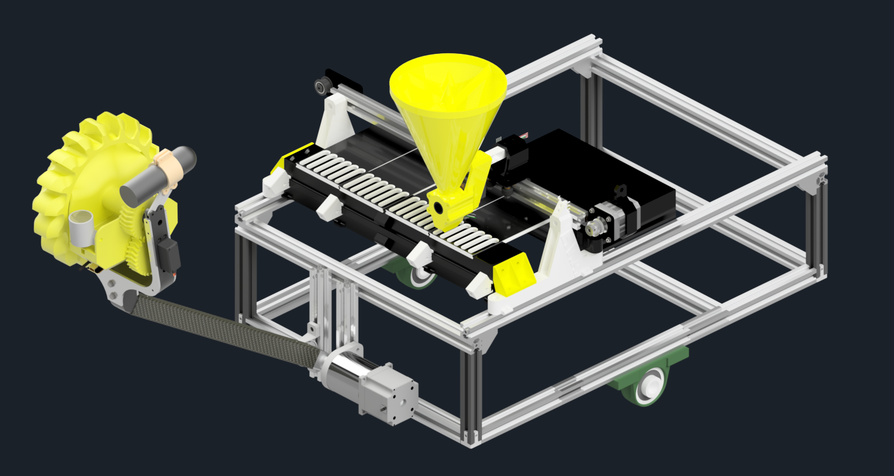
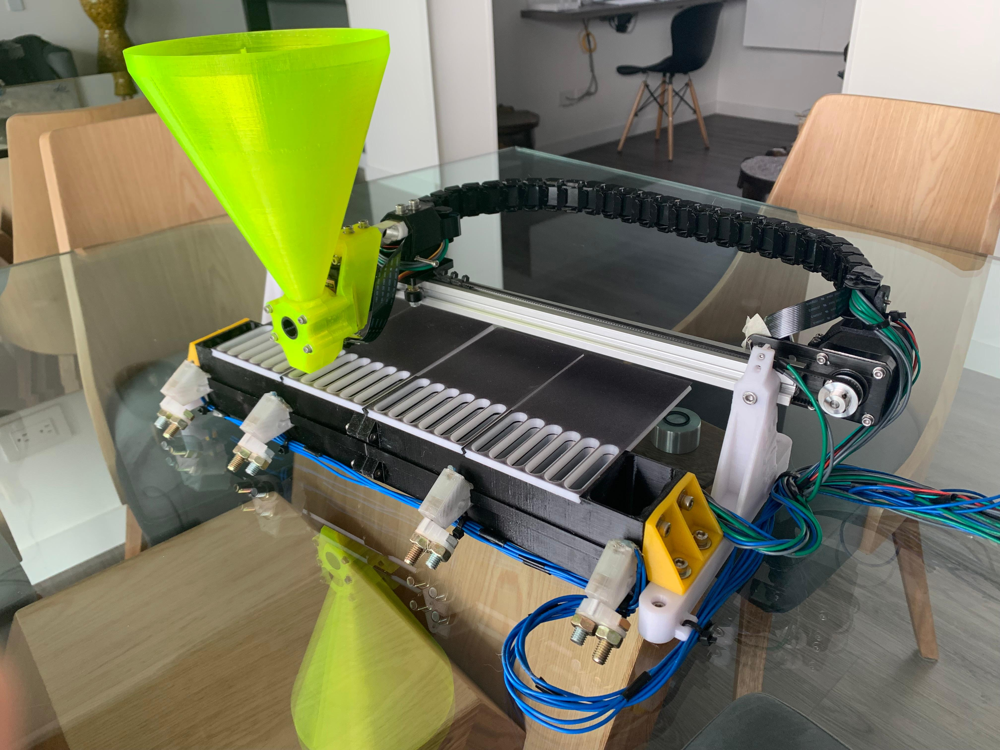
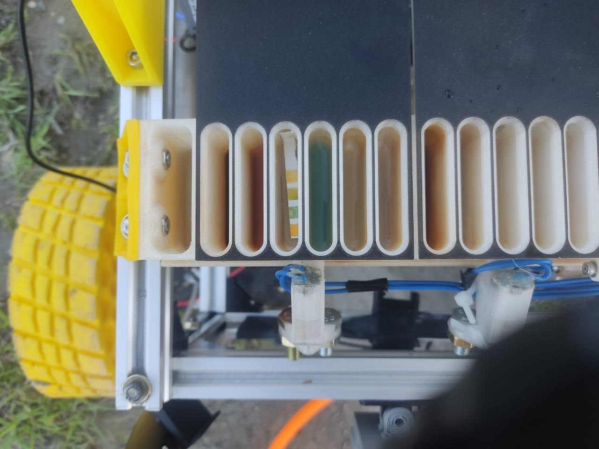
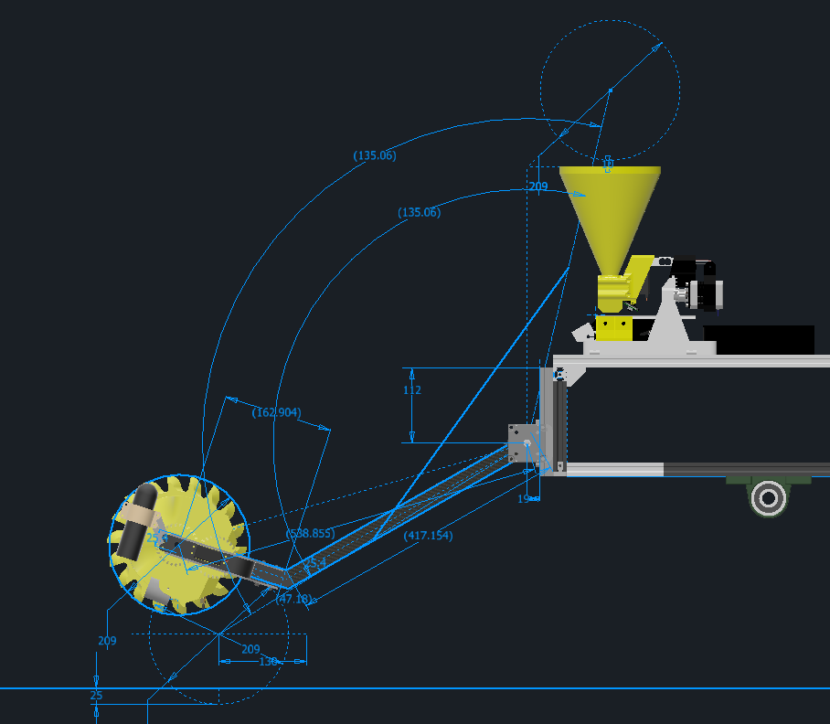
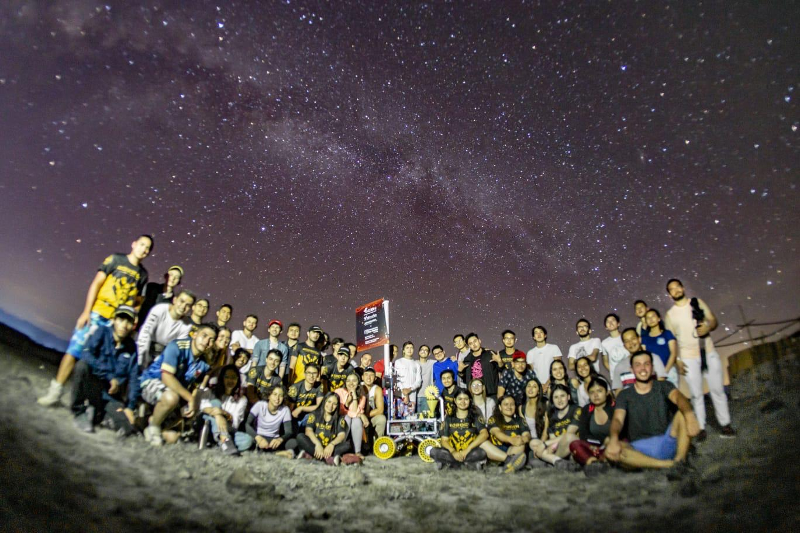
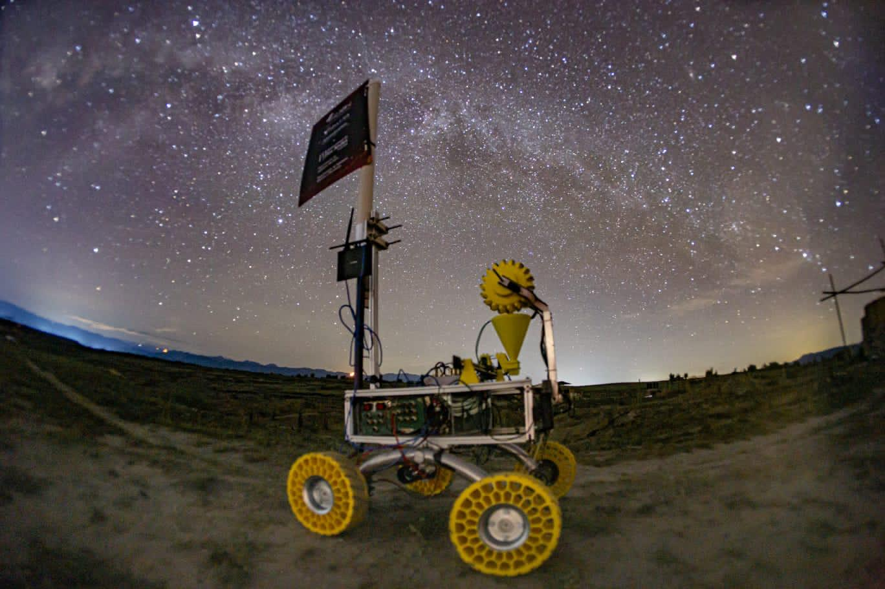

# Mecanismo de extracción de muestras y laboratorio de evaluación de presencia de vida para un rover de exploración a distancia

Este repositorio contiene los archivos CAD y el código de Arduino del laboratorio de detección de vida alienígena, E.V.A. (Evaluador de Vida Alienígena), y del sistema de extracción de muestras, RAMSES (Recolector y Analizador de Muestras SuperficialES), desarrollados para el rover de la competencia University Rover Challenge (URC) 2022.

## Descripción del Proyecto

### 1. **E.V.A. - Evaluador de Vida Alienígena**
E.V.A. es un sistema automatizado de análisis que permite la evaluación de vida alienígena en hasta 4 muestras simultáneas mediante 6 pruebas químicas distintas, ofreciendo datos sobre la presencia o ausencia de vida. Las muestras se distribuyen en 24 compartimentos mediante un actuador lineal de correa, y se dosifican utilizando un dispensador rotativo controlado por un servomotor de rotación continua y una válvula flexible en TPU. Una celda de carga mide el peso dosificado, y una cámara observa las reacciones químicas en cada compartimento. 

- **Pruebas químicas**: Detecta biomoléculas inorgánicas y orgánicas, como sales minerales y proteínas, usando reactivos especializados. 
  
- **Componentes principales**: Actuador lineal, servomotor, celda de carga, cámara, motores vibradores.
- **Fabricación**: Varias piezas fueron impresas en 3D, incluyendo compartimentos, tapas, soportes y el dispensador.

### 2. **RAMSES - Sistema de Extracción de Muestras**
RAMSES es el sistema encargado de recolectar, tamizar y medir la temperatura y humedad de las muestras antes de transferirlas a E.V.A. para su análisis. El sistema utiliza componentes impresos en 3D y un brazo controlado por un motor NEMA23 con reducción de 1:15, que permite el posicionamiento preciso del cabezal de excavación.

- **Funciones**: Recolección de muestras, tamizado, medición de temperatura y humedad.
- **Fabricación**: La mayoría de las piezas están fabricadas con impresión 3D.

### 3. **Caja Electrónica**
La caja de electrónica aloja los componentes electrónicos del subsistema de sensórica y extracción, protegiéndolos de condiciones ambientales adversas. 

---

## Contenido del Repositorio

El repositorio se estructura en las siguientes carpetas y archivos:

- **Caja Electronica**: Archivos CAD de la caja de electrónica.
- **code**: Archivos de código de Arduino que controlan los subsistemas.
- **EVA**: Archivos CAD del sistema E.V.A.
- **Extras**: Archivos CAD complementarios.
- **Ready to print files**: Archivos CAD listos para impresión 3D de diversas piezas.
- **Sistema de extracción**: Archivos CAD del sistema RAMSES.
- **Ensamble general.iam**: Ensamble general del rover, integrando E.V.A., RAMSES y otros subsistemas.

## Instrucciones de Uso

1. **Montaje**: Ensamble los sistemas siguiendo los modelos CAD disponibles.
2. **Programación**: Cargue el código en los controladores Arduino. El sistema está configurado para comunicarse con una Raspberry Pi 4, conectada a través de serial para el control de actuadores y lectura de sensores.
3. **Operación**: Los reactivos se deben pre-cargar en los compartimentos de E.V.A. antes de la competencia. El sistema RAMSES extraerá muestras y las transferirá a E.V.A. para su análisis.

## Créditos y Equipo

El diseño, prototipado, y manufactura de estos sistemas fueron realizados por el equipo de Robocol de la Universidad de los Andes, en colaboración con miembros de diversas disciplinas. Estos sistemas formaron parte del rover de Robocol, que compitió en la URC 2022, y están diseñados para proporcionar datos relevantes para la detección de vida en condiciones simuladas de Marte.

### Contacto
Para consultas sobre este proyecto, puedes contactar a [Robocol](https://www.instagram.com/robocol/).
